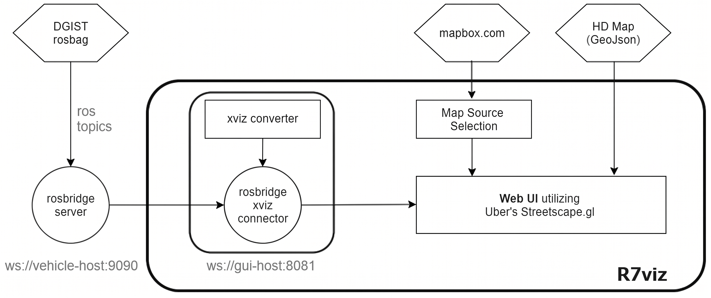

# R7viz

R7viz is a ROS-to-XVIZ visualization stack for autonomous-driving data. It connects to a ROS/ROS2 system through `rosbridge_server`, converts live ROS topics into the XVIZ protocol, and renders the result in a browser-based 3D interface built on Streetscape.gl.

This repository has been adapted for a ROS2 3D LiDAR object-detection workflow. The connector is configured to consume KITTI-style topics such as `/kitti/point_cloud`, `/kitti/nav_sat_fix`, `/kitti/imu`, `/kitti/image/color/left`, and `vision_msgs/msg/Detection3DArray` detections published on `/preds` when that detection subscriber is enabled.



## Table Of Contents

- [Features](#features)
- [Architecture](#architecture)
- [Repository Layout](#repository-layout)
- [Runtime Ports And Data Flow](#runtime-ports-and-data-flow)
- [Prerequisites](#prerequisites)
- [Installation](#installation)
- [Running The Stack](#running-the-stack)
- [Configuration](#configuration)
- [ROS Topics](#ros-topics)
- [Map Tile Server](#map-tile-server)
- [Development Scripts](#development-scripts)
- [Troubleshooting](#troubleshooting)
- [References](#references)

## Features

- Live 3D visualization of LiDAR point clouds through XVIZ.
- Vehicle localization from GPS and IMU data.
- Camera-image display through ROS image topics.
- Object and bounding-box visualization for autonomous-driving perception outputs.
- HD map overlays for DGIST lane and centerline data.
- Multiple driving-view modes including top-down, perspective, and driver views.
- Runtime UI controls for server address, Mapbox token, map style, and stream visibility.
- Frame-rate and worker-status monitoring for browser-side debugging.

## Architecture

R7viz is split into three main runtime components:

1. **ROS / ROS2 data source** publishes vehicle, LiDAR, camera, localization, and perception topics.
2. **rosbridge-xviz-connector** subscribes to ROS topics over `rosbridge_server`, converts messages into XVIZ frames, and exposes an XVIZ websocket server.
3. **gui** connects to the XVIZ websocket server and renders the scene in a browser with Streetscape.gl, Deck.gl layers, React widgets, and Mapbox maps.

Video examples from the original project:

- [Testing rosbag](http://www.youtube.com/watch?v=P9XaBmR8r5Q)
- [Testing on iPad](http://www.youtube.com/watch?v=iMz-QFy0sWc)

## Repository Layout

```text
R7viz/
├── gui/                         # React + Streetscape.gl web client
│   ├── src/                     # UI, map, HUD, style, and data-layer source files
│   ├── assets/                  # UI and vehicle assets
│   ├── dist/                    # Built frontend output
│   ├── package.json             # Frontend dependencies and scripts
│   └── webpack.config.js        # Webpack 4 development/build config
├── rosbridge-xviz-connector/    # ROS websocket to XVIZ websocket proxy
│   ├── XVIZ_Converter/          # Message-specific XVIZ converters
│   ├── index.js                 # Connector entrypoint and ROS topic subscriptions
│   ├── xviz-server.js           # XVIZ websocket server
│   └── package.json             # Connector dependencies and scripts
├── map-tile-server/             # Notes for running a local tileserver-gl-light server
├── photo/                       # README images and screenshots
├── reports/                     # Project reports and diagrams
├── R7viz_install.sh             # Legacy helper script from the original project
├── README_temp.md               # Original project README notes
└── README.md                    # Project documentation
```

`node_modules` directories are intentionally not documented or inspected. Dependency information comes from the package manifests in `gui/package.json` and `rosbridge-xviz-connector/package.json`.

## Runtime Ports And Data Flow

| Component | Default endpoint | Purpose |
| --- | --- | --- |
| `rosbridge_server` | `ws://localhost:9090` | ROS websocket bridge consumed by the connector and parts of the GUI |
| `rosbridge-xviz-connector` | `ws://localhost:8081` | XVIZ websocket server consumed by the browser UI |
| `gui` dev server | `http://localhost:8080/` | Web application served by webpack-dev-server |
| Optional map tile server | `http://localhost:10001/` | Local vector-tile service when using offline/custom map tiles |

High-level data flow:

```text
ROS / ROS2 publishers
      │
      ▼
rosbridge_server :9090
      │
      ▼
rosbridge-xviz-connector
      │  ROS messages -> XVIZ frames
      ▼
XVIZ websocket :8081
      │
      ▼
R7viz GUI in browser :8080
```

## Prerequisites

- Ubuntu Linux environment. The original project targeted Ubuntu 18.04 and ROS Melodic; this branch is configured for ROS2 topic names and message type strings.
- ROS or ROS2 with `rosbridge_server` / `rosbridge_suite` available.
- Node.js and Yarn. The dependency set is legacy and works best with an older Node.js runtime; the original setup used Node.js `10.16`.
- A browser with WebGL support.
- Optional: a Mapbox access token, or a local map tile server.

For ROS2, install rosbridge with the package matching your distribution, for example:

```bash
sudo apt update
sudo apt install ros-${ROS_DISTRO}-rosbridge-server
```

For ROS1 Melodic legacy usage:

```bash
sudo apt update
sudo apt install ros-melodic-rosbridge-server
```

## Installation

Clone the repository into your ROS workspace or preferred development directory:

```bash
cd ~/ros2_ws/src
git clone <repository-url> R7viz
cd R7viz
```

Install the XVIZ connector dependencies:

```bash
cd rosbridge-xviz-connector
yarn install
```

Install the frontend dependencies:

```bash
cd ../gui
yarn install
```

If your package manager enforces modern engine constraints, the legacy project may require:

```bash
yarn install --ignore-engines
```

## Running The Stack

Start each service in a separate terminal.

### 1. Start ROS2 Data Publishers

Run your perception pipeline, rosbag, simulator, or sensor drivers so the expected topics are available. For the ROS2 LiDAR detection integration, the important topics are `/kitti/point_cloud` and `/preds`.

Example rosbag-style workflow:

```bash
ros2 bag play <bag-directory>
```

### 2. Start rosbridge_server

ROS2:

```bash
ros2 launch rosbridge_server rosbridge_websocket_launch.xml
```

ROS1 legacy:

```bash
roslaunch rosbridge_server rosbridge_websocket.launch
```

The connector expects rosbridge at `ws://localhost:9090` by default.

### 3. Start The XVIZ Connector

```bash
cd ~/ros2_ws/src/R7viz/rosbridge-xviz-connector
yarn start
```

Expected result:

```text
xviz server starting on ws://localhost:8081
Connected to rosbridge websocket server.
```

### 4. Start The Web GUI

```bash
cd ~/ros2_ws/src/R7viz/gui
yarn start
```

Open:

```text
http://localhost:8080/
```

To connect to a remote ROS/XVIZ host, pass the `server` query parameter:

```text
http://localhost:8080/?server=<host-or-ip>
```

## Configuration

The GUI accepts URL query parameters:

| Parameter | Default | Description |
| --- | --- | --- |
| `server` | `localhost` | Hostname/IP used for rosbridge `:9090` and XVIZ `:8081` websocket connections |
| `maptoken` | Built-in token in `gui/src/app.js` | Mapbox access token |
| `mapstyle` | Built-in navigation style in `gui/src/app.js` | Mapbox style URL |

Example:

```text
http://localhost:8080/?server=192.168.1.20&maptoken=<token>&mapstyle=mapbox://styles/<user>/<style-id>
```

Connector endpoints and topic subscriptions are currently configured directly in `rosbridge-xviz-connector/index.js`.

## ROS Topics

The active connector configuration subscribes to these topics:

| Topic | Message type | Purpose |
| --- | --- | --- |
| `/kitti/nav_sat_fix` | `sensor_msgs/msg/NavSatFix` | Vehicle GPS position |
| `/kitti/imu` | `sensor_msgs/msg/Imu` | Vehicle orientation / IMU data |
| `/kitti/point_cloud` | `sensor_msgs/msg/PointCloud2` | LiDAR point cloud |
| `/kitti/image/color/left` | `sensor_msgs/msg/Image` | Camera image input for XVIZ conversion |
| `/kitti/marker_array` | `visualization_msgs/msg/MarkerArray` | Marker-array obstacle visualization |

The codebase also contains integration notes for ROS2 3D LiDAR object detection using:

| Topic | Message type | Purpose |
| --- | --- | --- |
| `/preds` | `vision_msgs/msg/Detection3DArray` | 3D detection boxes from the LiDAR prediction node |

The object-detection parser maps KITTI classes into R7viz visualization classes:

| KITTI class | Meaning | R7viz class |
| --- | --- | --- |
| `0` | Car | `1` |
| `1` | Pedestrian | `6` |
| `2` | Cyclist | `4` |

The frontend also subscribes directly to `/usb_cam/image_compressed/compressed` for the camera image element in `gui/src/app.js`.

## Map Tile Server

The `map-tile-server/` directory documents optional local map tile serving through `tileserver-gl-light`.

Install the tile server globally:

```bash
sudo npm install --unsafe-perm=true -g tileserver-gl-light
```

Place an `.mbtiles` file in `map-tile-server/`, then run:

```bash
cd map-tile-server
tileserver-gl-light -p 10001
```

This is optional if you use Mapbox-hosted styles.

## Development Scripts

### GUI

Run the development server:

```bash
cd gui
yarn start
```

Build static assets:

```bash
cd gui
yarn build
```

Key frontend dependencies include React, Streetscape.gl, roslib, loaders.gl, webpack, Babel, Sass loaders, and supporting UI packages listed in `gui/package.json`.

### XVIZ Connector

Run the connector:

```bash
cd rosbridge-xviz-connector
yarn start
```

Key connector dependencies include roslib, `@xviz/builder`, `@xviz/parser`, ws, math.gl, utm-latlng, sharp, binary-parser, lodash, base64-to-uint8array, and `@turf/turf` as listed in `rosbridge-xviz-connector/package.json`.

## Troubleshooting

- **`Cannot infer topic type` from rosbridge**: ensure the connector topic has an explicit `messageType` and that the ROS topic name matches the publisher.
- **GUI opens but no scene updates**: verify rosbridge is running on `:9090`, the connector is running on `:8081`, and your browser URL uses the correct `server` parameter.
- **No LiDAR points**: confirm `/kitti/point_cloud` is publishing `sensor_msgs/msg/PointCloud2` and the connector terminal is receiving frames.
- **Object boxes are missing**: confirm `/preds` publishes `vision_msgs/msg/Detection3DArray` and that the detection subscriber is enabled in `rosbridge-xviz-connector/index.js`.
- **Webpack parse errors with modern packages**: keep the pinned legacy-compatible package versions from the existing `package.json` files, especially `gui` `roslib@1.1.0`, connector `@turf/turf@6.5.0`, and connector `sharp@0.28.3`.
- **Map does not render**: check the Mapbox token/style parameters or run a local tile server and update the map style configuration accordingly.

## References

- [AVS](https://avs.auto)
- [XVIZ](https://github.com/uber/xviz)
- [Streetscape.gl](https://github.com/uber/streetscape.gl)
- [rosbridge_suite](https://github.com/RobotWebTools/rosbridge_suite)
- [Autoronto GUI](https://github.com/leonzz/argus-autoronto)
- [Ford Autonomous Trucks HMI](https://github.com/aliekingurgen/ford-autonomous-vehicles-hmi)
